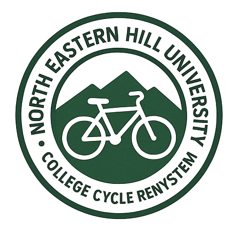
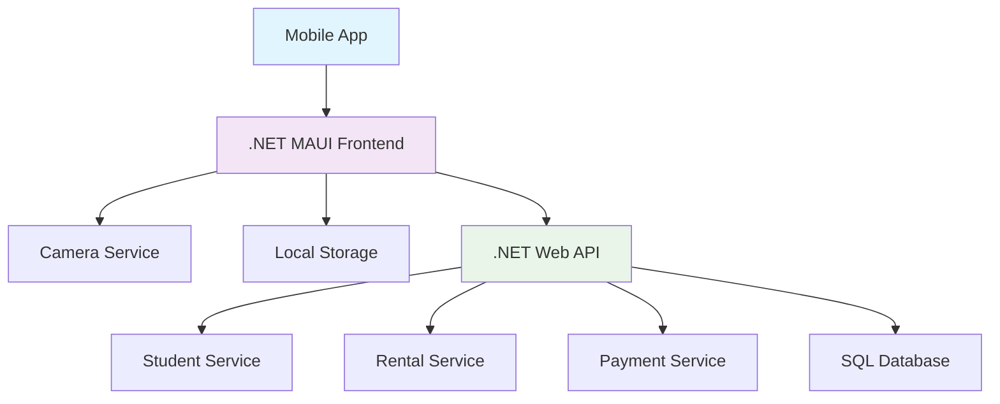

# 🚲 College Cycle Rental System 

[](https://dotnet.microsoft.com/)
[](https://dotnet.microsoft.com/apps/maui)
[](https://creativecommons.org/licenses/by/4.0/)

A modern digital solution that revolutionizes traditional cycle rentals by leveraging college ID scanning technology. Automate time tracking, payment calculations, and rental management with this intuitive cross-platform application.

## 🌟 Why Choose Our System?

| Traditional Paper System        | Our Digital Solution |
|---------------------------------|-------------------------------------------|
| 📝 Manual time tracking         | ⏱️ Automated timer with real-time updates  |
| 🧮 Error-prone calculations     | 💰 Instant cost calculation                |
| 📄 Physical record keeping      | 💾 Digital database with cloud sync        |
| ❌ No student verification      | 🆔 College ID-based authentication         |
| 📊 Manual reporting             | 📈 Automated analytics & reports           |

## 🎯 Key Features

### ✨ Core Functionality
- **Instant ID Scanning** - QR/Barcode recognition for quick student identification
- **Live Rental Tracking** - Real-time timer with running cost display
- **Automated Payments** - Smart calculation based on configurable rates
- **Offline Capability** - Works seamlessly without internet connection
- **Cross-Platform** - Runs on both iOS and Android devices

### 📊 Advanced Capabilities
- **Admin Dashboard** - Comprehensive overview of all operations
- **Financial Reports** - Daily, weekly, and monthly earnings analytics
- **Student History** - Complete rental track record per student
- **Rate Management** - Flexible pricing configurations
- **Inventory Management** - Cycle availability and status tracking

## 🚀 Quick Start

### Prerequisites
- .NET 6.0+ SDK
- SQL Server 2019+
- Mobile device with camera (iOS/Android)

### Installation
```bash
# Clone the repository
git clone https://github.com/your-org/college-cycle-rental.git

# Navigate to project directory
cd college-cycle-rental

# Restore dependencies
dotnet restore

# Run database migrations
dotnet ef database update

# Build and deploy
dotnet build
```

### Configuration
1. Update connection string in `appsettings.json`
2. Configure rental rates in admin panel
3. Set up student database (CSV import supported)
4. Deploy to admin mobile device

## 🏗️ System Architecture



### Technology Stack
- **Frontend**: .NET MAUI (Cross-platform mobile development)
- **Backend**: ASP.NET Core Web API
- **Database**: SQL Server with Entity Framework Core
- **Authentication**: College ID-based scanning
- **Storage**: Local SQLite with cloud sync capability

## 📱 User Journey

### 🎓 For Students
1. **Approach Station** → Present College ID
2. **Quick Scan** → Instant verification (< 3 seconds)
3. **Receive Cycle** → Automated timer starts
4. **Enjoy Ride** → No time pressure
5. **Return Cycle** → Instant payment calculation
6. **Pay & Complete** → Digital receipt available

### 👨‍💼 For Admin Staff
1. **Open App** → Tap "New Rental"
2. **Scan ID** → Camera auto-detects QR code
3. **Verify Details** → Student info displayed
4. **Approve** → Timer starts automatically
5. **Monitor** → Live dashboard view
6. **Process Return** → Auto-stop timer & calculate cost

## 💾 Database Schema

### Students Table
| Column | Type | Description |
|--------|------|-------------|
| StudentID | INT PK | Unique identifier |
| IDNumber | VARCHAR | College ID barcode number |
| FullName | VARCHAR | Student's full name |
| Department | VARCHAR | Academic department |
| Email | VARCHAR | Contact email |
| Phone | VARCHAR | Mobile number |
| PhotoUrl | VARCHAR | Student photo URL |
| IsActive | BIT | Account status |

### Rentals Table
| Column | Type | Description |
|--------|------|-------------|
| RentalID | INT PK | Rental transaction ID |
| StudentID | INT FK | Reference to student |
| StartTime | DATETIME | Rental commencement |
| EndTime | DATETIME | Rental completion |
| TotalDuration | INT | Minutes rented |
| AmountDue | DECIMAL | Calculated cost |
| AmountPaid | DECIMAL | Actual payment received |
| Status | VARCHAR | Active/Completed/Cancelled |
| CreatedAt | DATETIME | Record creation timestamp |

## 🎨 UI/UX Design

### Dashboard Interface
```
┌─────────────────────────────────────────┐
│  🚲 COLLEGE CYCLE RENTAL               │
├─────────────────────────────────────────┤
│  [ SCAN ID FOR RENTAL ]      ⭐⭐⭐⭐⭐  │
│                                      │
│  📊 TODAY'S STATS                   │
│  • Active Rentals: 3      • ₹245     │
│  • Completed: 12          • 4.2h     │
│                                      │
│  ⏰ ACTIVE RENTALS                   │
│  ┌─ Raj Sharma ──────── 01:24 ──┐    │
│  │ CSE • ₹25 due               │    │
│  └──────────────────────────────┘    │
│  ┌─ Priya Patel ─────── 00:38 ──┐    │
│  │ ECE • ₹15 due               │    │
│  └──────────────────────────────┘    │
└─────────────────────────────────────────┘
```

### Key Design Principles
- **One-Hand Operation** - Large buttons and intuitive navigation
- **Quick Actions** - Most tasks completed in 2-3 taps
- **Real-Time Feedback** - Immediate visual confirmation
- **Accessibility** - High contrast, large text for outdoor use

## ⚙️ Configuration

### Rental Rates Setup
```json
{
  "RentalRates": {
    "FirstHour": 20,
    "Additional30Min": 10,
    "DailyMax": 100,
    "Currency": "INR"
  }
}
```

### College Specific Settings
- ID barcode format configuration
- Department mapping
- Payment methods (Cash/College Wallet)
- Rental policies and limits

## 📈 Reporting & Analytics

### Available Reports
- **Daily Summary** - Rentals, revenue, peak hours
- **Student Analytics** - Frequent users, department-wise usage
- **Financial Reports** - Revenue trends, collection efficiency
- **Operational Metrics** - Cycle utilization, return time analysis

### Sample Dashboard Metrics
```
📅 Daily Report - 15 Dec 2024
─────────────────────────────
Total Rentals: 27
Total Revenue: ₹1,350
Avg Rental Time: 42 min
Peak Hour: 2:00 PM - 3:00 PM
Most Active: Computer Science
```

## 🔧 Development

### Project Structure
```
CollegeCycleRental/
├── src/
│   ├── MobileApp/          # .NET MAUI frontend
│   ├── WebAPI/            # ASP.NET Core backend
│   └── Shared/            # Shared models & utilities
├── docs/                  # Documentation
├── database/              # SQL scripts & migrations
└── tests/                 # Unit & integration tests
```

### Building from Source
```bash
# Build the solution
dotnet build CollegeCycleRental.sln

# Run tests
dotnet test

# Generate deployment package
dotnet publish -c Release
```

## 🤝 Contributing

We love contributions! Here's how you can help:

1. **Fork** the repository
2. **Create** a feature branch (`git checkout -b feature/amazing-feature`)
3. **Commit** your changes (`git commit -m 'Add amazing feature'`)
4. **Push** to the branch (`git push origin feature/amazing-feature`)
5. **Open** a Pull Request

### Development Setup
1. Install Visual Studio 2022+ with .NET MAUI workload
2. Configure SQL Server instance
3. Set up mobile emulators or physical devices
4. Run the application using `F5` in Visual Studio

## 🐛 Troubleshooting

### Common Issues
| Problem | Solution |
|---------|----------|
| Camera not working | Check app permissions |
| ID scan failing | Ensure good lighting and focus |
| Sync issues | Verify internet connection |
| Performance lag | Clear app cache and restart |

### Support
- 📧 Email: support@collegerental.com
- 🐛 [Issue Tracker](https://github.com/your-org/college-cycle-rental/issues)
- 📚 [Documentation Wiki](https://github.com/your-org/college-cycle-rental/wiki)

## 📄 License

This project is licensed under the NEHU License - see the [LICENSE](LICENSE) file for details.

## 🙏 Acknowledgments

- College administration for supporting digital transformation
- Student feedback team for continuous improvement suggestions
- .NET MAUI community for excellent cross-platform tools

---

## 📚 Documentation Downloads

For detailed documentation, check out:
- 📄 [**System Design Document**](./system-design-document.pdf) - Technical architecture and implementation details
- 📖 [**User Manual**](./user-manual.pdf) - Complete guide for administrators and staff

---

<div align="center">

**Ready to transform your college's cycle rental system?** 🚀

*Get started today and join the digital revolution!*

[](https://apps.apple.com)
[](https://play.google.com)

</div>
